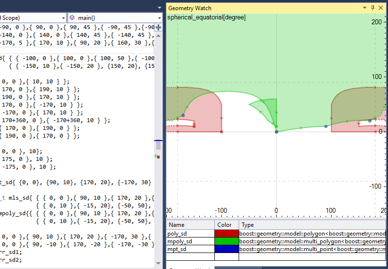
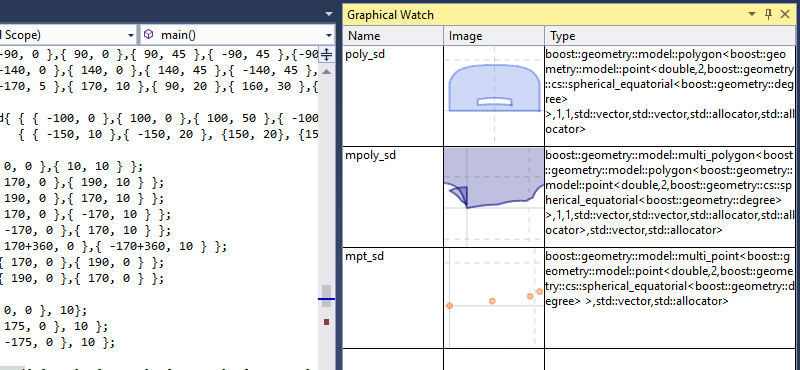
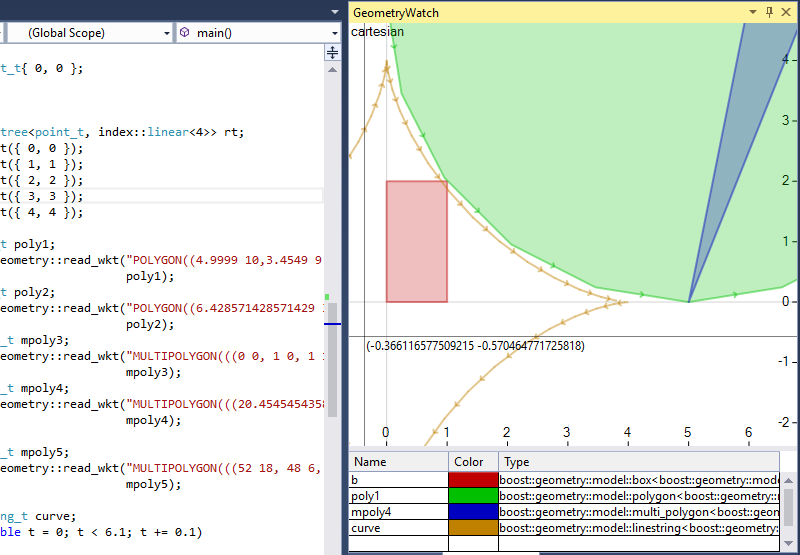

# GraphicalDebugging extension for Visual Studio 2015 and 2017

This extension allows to display graphical representation of variables during debugging.

Currently it supports Boost.Geometry and Boost.Polygon models, Boost.Variant and STL/Boost containers of values. It contains:

* Debugging visualizers for Boost.Array, Boost.Container, Boost.Geometry, Boost.MPL, Boost.Polygon, Boost.Tuple and Boost.Variant
* Geometry Watch tool window displaying geometries in a common coordinate system, e.g. Boost.Geometry or Boost.Polygon polygons
* Graphical Watch tool window displaying graphical representation of variables, e.g. Boost.Geometry models or vectors of values
* Plot Watch tool window displaying plot representation of variables, e.g. vector of doubles

Feel free to report bugs, propose features and create pull requests. Any help is appreciated.

##### Download

You can download this extension from [Visual Studio Gallery](https://visualstudiogallery.msdn.microsoft.com/4b81868b-8901-408f-a28e-25a6580788fb).

##### Contact

You may contact me at [Boost.Geometry mailing list](http://lists.boost.org/mailman/listinfo.cgi/geometry).

##### Instructions

###### Build

You need Microsoft Visual Studio 2015 Update 3, .NET Framework 4.5.2 and Visual Studio 2015 SDK.

###### Install

To install after building double-click the *.vsix file from bin/Debug or bin/Relase directory.

This extension works with Visual Studio 2015 and 2017.

###### Use

1. place a breakpoint somewhere in the code
2. start debugging
3. after a breakpoint hit enable the tool window from the menu
   * **View**->**Other Windows**->**Geometry Watch**
   * **View**->**Other Windows**->**Graphical Watch**
   * **View**->**Other Windows**->**Plot Watch**
4. write the name of a variable in an edit box on the list

#### Details

##### Debugging vizualizers

Supported:

* Boost.Array: array
* Boost.Container: vector, static_vector
* Boost.Geometry:
  * de9im: mask, matrix, static_mask
  * detail: turn_info, traversal_turn_info, turn_operation, turn_operation_linear, traversal_turn_operation, segment_ratio
  * index: rtree, varray
  * model: point, point_xy, box, segment, referring_segment, polygon, multi_point, multi_linestring, multi_polygon, nsphere
* Boost.MPL: int_, size_t, integral_c, vector, vector_c
* Boost.Polygon: point_data, interval_data, segment_data, rectangle_data, polygon_data, polygon_with_holes_data
* Boost.Tuple: tuple, cons
* Boost.Variant: variant

##### Geometry Watch

Watch window displaying graphical representation of variables in a single image. This allows to compare the variables easily.

Supported:

* 2D cartesian geometries
  * Boost.Geometry: point, point_xy, box, segment, referring_segment, polygon, multi_point, multi_linestring, multi_polygon, nsphere
  * Boost.Polygon: point_data, segment_data, rectangle_data, polygon_data, polygon_with_holes_data
* Non-cartesian geometries (spherical_equatorial and geographic)
  * Boost.Geometry: point, box, segment, referring_segment, polygon, multi_point, multi_linestring, multi_polygon, nsphere
* Variants of geometries
  * Boost.Variant

Geometries in spherical_equatorial and geographic coordinate systems are displayed in a way allowing to see what coordinates were used to define a geometry. Note that various libraries may require coordinates in a certain range. This extension tries to display any coordinates as good as possible.

where

    polygon_sd_t poly_sd{{{-100, 0},{100, 0},{100, 50},{-100, 50},{-100, 0}},
                         {{-150, 10},{-150, 20},{150, 20},{150, 10},{-150, 10}}};
    multi_polygon_sd_t mpoly_sd{{{{0, 0},{90, 10},{170, 20},{-170, 30},{-150, 60}},
                                 {{0, 10},{-15, 20},{-50, 50},{0, 60}}}};
    multi_point_sd_t mpt_sd{{0, 0},{90, 10},{170, 20},{-170, 30}};

##### Graphical Watch

Watch window displaying graphical representations of variables in a list. Each variable is placed and visualized in a separate row.

Supported:

* Containers of elements convertible to double
  * STL: array, vector, deque, list
  * Boost.Array: array
  * Boost.Container: vector, static_vector
* 2D cartesian geometries
  * Boost.Geometry: point, point_xy, box, segment, referring_segment, polygon, multi_point, multi_linestring, multi_polygon, nsphere
  * Boost.Polygon: point_data, segment_data, rectangle_data, polygon_data, polygon_with_holes_data
* Non-cartesian geometries (spherical_equatorial and geographic)
  * Boost.Geometry: point, box, segment, referring_segment, polygon, multi_point, multi_linestring, multi_polygon, nsphere
* Variants of geometries
  * Boost.Variant

Geometries in spherical_equatorial and geographic coordinate systems are displayed in a convenient, compact way.

where

    polygon_sd_t poly_sd{{{-100, 0},{100, 0},{100, 50},{-100, 50},{-100, 0}},
                         {{-150, 10},{-150, 20},{150, 20},{150, 10},{-150, 10}}};
    multi_polygon_sd_t mpoly_sd{{{{0, 0},{90, 10},{170, 20},{-170, 30},{-150, 60}},
                                 {{0, 10},{-15, 20},{-50, 50},{0, 60}}}};
    multi_point_sd_t mpt_sd{{0, 0},{90, 10},{170, 20},{-170, 30}};

##### Plot Watch

Watch window displaying plot representation of variables in a single image. Type of plot can be set in **Options**.

Supported containers of values convertible to double:
  * STL: array, vector, deque, list
  * Boost.Array: array
  * Boost.Container: vector, static_vector

##### Zooming/cropping

Geometry Watch and Plot Watch has zooming/cropping feature.

##### Options

Options for each Watch can be found under **Tools**->**Options**->**Graphical Debugging**

##### Themes

The extension supports Visual Studio themes. The visualization of variables may be drawn in two versions, dark or light depending on the brightness of the theme background color.

